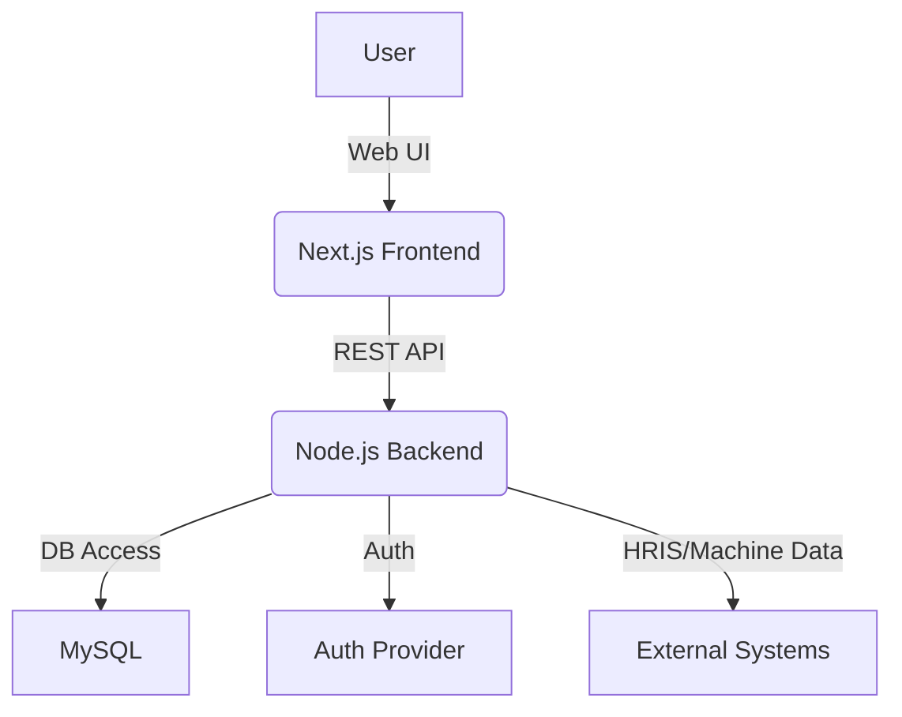

# Software Requirements Specification (SRS)

## Project: Dawlance Internship Skills Matrix
**Version:** 1.0  
**Date:** April 26, 2026  
**Authors:** Project Team

## 1. Introduction
### 1.1 Purpose
This Software Requirements Specification (SRS) defines the requirements for the Dawlance Internship Skills Matrix, a web-based platform for managing, visualizing, and analyzing employee skills, department performance, and machine assignments. The SRS aims to provide a clear, comprehensive, and formal description of the system’s intended functionality, constraints, and quality attributes for all stakeholders.

### 1.2 Scope
The Skills Matrix system will:
- Enable tracking, assessment, and visualization of employee skills and certifications
- Support department and machine performance analytics
- Facilitate skill gap analysis, reporting, and recommendations
- Provide secure, role-based access for administrators, managers, and employees
- Integrate with internal HR and machine data sources
- Offer data import/export and audit capabilities

### 1.3 Objectives
- Improve workforce planning and upskilling
- Enhance transparency in skill management
- Support data-driven decision-making for HR and operations

### 1.4 Definitions, Acronyms, and Abbreviations
- SRS: Software Requirements Specification
- UI: User Interface
- API: Application Programming Interface
- DB: Database
- RBAC: Role-Based Access Control

### 1.5 References
1. Project repository documentation, Dawlance Internship Skills Matrix Main
2. Dawlance Internship Skills Matrix Main README file
3. IEEE 830-1998, IEEE Recommended Practice for Software Requirements Specifications

## 2. Overall Description
### 2.1 Product Perspective
The Skills Matrix is a modular, scalable web application built with Next.js, TypeScript, and MySQL. It is designed to integrate with existing HR and machine data systems, providing a unified platform for skills and performance management.

### 2.2 Product Functions
- Secure user authentication and RBAC
- Employee, department, and machine management
- Skill matrix visualization, editing, and history tracking
- Machine assignment and performance tracking
- Analytics dashboards and skill gap reporting
- Data import/export (CSV, JSON)
- Audit logging and error handling

### 2.3 User Classes and Characteristics
- **Administrator:** Full access to all system features, user management, and audit logs
- **Manager:** Access to department-level data, analytics, and reporting
- **Employee:** Access to personal skill matrix, history, and recommendations

### 2.4 Operating Environment
- Modern web browsers (Chrome, Edge, Firefox)
- Node.js server environment
- MySQL database

### 2.5 Design and Implementation Constraints
- Must use Next.js and TypeScript
- MySQL as the primary database
- Responsive and accessible design (WCAG 2.1 compliance)
- Secure coding practices (OWASP Top 10)

### 2.6 User Documentation
- Comprehensive user manual
- In-app contextual help and tooltips
- API documentation (OpenAPI/Swagger)

### 2.7 Assumptions and Dependencies
- Users have valid organizational credentials
- Data sources are accessible and up-to-date
- Internet connectivity for cloud deployment

## 3. Specific Requirements
### 3.1 Functional Requirements
#### 3.1.1 User Authentication & Authorization
- Users must log in with secure credentials (OAuth2/SSO support)
- Role-based access control (Admin, Manager, Employee)
- Password reset and account recovery
- Session management and timeout

#### 3.1.2 Employee Management
- Add, edit, deactivate, and delete employee records
- Assign skills, certifications, and proficiency levels
- Track employee history and changes (audit trail)
- Bulk import/export of employee data

#### 3.1.3 Department Management
- Create, edit, and delete departments
- Assign employees to departments
- View and analyze department performance

#### 3.1.4 Skill Matrix Management
- Visualize skills matrix for departments/employees
- Edit skill assignments and proficiency levels
- Import/export skill data (CSV, JSON)
- Track changes and maintain version history

#### 3.1.5 Machine Assignment & Tracking
- Assign machines to employees/departments
- Track machine usage, maintenance, and performance
- Generate machine utilization reports

#### 3.1.6 Analytics, Reporting & Recommendations
- Generate skill gap, department, and machine performance reports
- Visualize data with interactive dashboards (charts, graphs)
- Export analytics data (PDF, CSV)
- Provide upskilling and training recommendations

#### 3.1.7 Notifications & Alerts
- Email and in-app notifications for key events (expiring certifications, skill gaps, etc.)

#### 3.1.8 Audit Logging & Error Handling
- Log all critical actions and changes
- Provide user-friendly error messages and recovery options

#### 3.1.9 Compliance & Data Privacy
- Ensure GDPR and local data protection compliance
- Allow users to view, export, and request deletion of their data

### 3.2 Non-Functional Requirements
- **Performance:** Main dashboards load in <2 seconds; bulk operations complete within 10 seconds
- **Security:** Data encryption in transit and at rest; secure authentication; regular security audits
- **Usability:** Intuitive, accessible UI (WCAG 2.1 AA); onboarding guides
- **Reliability:** 99.9% uptime; automated backups; error logging and alerting
- **Scalability:** Support for 10,000+ employees and 100+ departments
- **Maintainability:** Modular codebase, automated tests, CI/CD pipeline
- **Portability:** Deployable on cloud or on-premises

### 3.3 External Interface Requirements
- **UI:** Responsive, cross-browser web interface
- **API:** RESTful endpoints with OpenAPI documentation
- **Database:** MySQL schema for employees, departments, skills, machines, audit logs
- **Integration:** Support for HRIS and machine data import

## 4. System Architecture
### 4.1 High-Level Architecture
- **Frontend:** Next.js (React, TypeScript, Tailwind CSS)
- **Backend:** Node.js API (REST), authentication provider integration
- **Database:** MySQL (cloud or on-premises)
- **CI/CD:** Automated testing and deployment pipeline

### 4.2 Component Diagram (Mermaid)

### 4.3 Data Flow
1. User interacts with the web UI
2. Frontend communicates with backend via REST API
3. Backend processes requests, applies business logic, and interacts with MySQL
4. Authentication and authorization handled via provider
5. Data imported/exported as needed

## 5. Appendices
### 5.1 User Stories & Use Cases
- As an **Admin**, I want to manage users, departments, and audit logs so that I can ensure data integrity and compliance.
- As a **Manager**, I want to view department skill gaps and assign training so that my team remains competitive.
- As an **Employee**, I want to view and update my skill profile so that I can track my growth.

### 5.2 Sample Data Formats
- Employee (JSON): `{ "id": "E123", "name": "John Doe", "skills": [ { "skill": "Welding", "level": 3 } ] }`
- Department (JSON): `{ "id": "D01", "name": "Assembly", "employees": ["E123", "E124"] }`

### 5.3 User Role Matrix
| Role        | Manage Users | View Analytics | Edit Skills | Export Data | Access Audit Logs |
|-------------|:------------:|:--------------:|:-----------:|:-----------:|:-----------------:|
| Admin       |      ✓       |       ✓        |      ✓      |      ✓      |         ✓         |
| Manager     |      ✗       |       ✓        |      ✓      |      ✓      |         ✗         |
| Employee    |      ✗       |       ✗        |      ✓*     |      ✗      |         ✗         |
*Employees can only edit their own profile.

### 5.4 Glossary
- **Skill Gap:** The difference between required and actual skills for a role or department.
- **Audit Log:** A record of all significant actions and changes in the system.

### 5.5 Future Enhancements
- AI-driven skill recommendations
- Integration with e-learning platforms
- Advanced analytics and forecasting

---
This SRS is a controlled document. All changes must be reviewed and approved by the project stakeholders.
